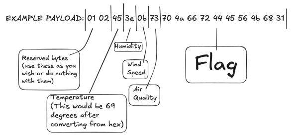

# Arduino Firmware
As described above, this is not a box but rather a device that will be physically transmitting
weather data and a flag for your team over radio. By default it will transmit data over plaintext.
Due to a recent partnership with a secretive geo-engineering company, the data that the
weather balloon collects must be kept secret. Here's how it works:

Since LoRa can only send small payloads of data and we want to send everything in one
payload, we must be efficient with how weather data is formatted.

The very first byte (not pictured) will be your team number which is out of your control/cannot be
manipulated so that the data gets posted to the correct TEAM_X/weather-data topic i.e.
TEAM_40/weather_data.

The firmware can be attained here:
https://github.com/Januszski/ISU_1_2025_Weather_Balloon_Firmware
Keep in mind you are ONLY to modify the contents of manipulateOutgoingPayloadData(),
nothing else.

You may use TRANSMITTAL_ITERATION. This will be manually adjusted by ISEAGE for each
iteration, for example if its the first time we broadcast data for your team it will be set to 1,
second time it will be set to 2 and so on.

On top of providing confidentiality to the data being transmitted by the weather balloon, think of
other things you may be worried about as a security engineer. What if attackers capture a
broadcast and later do a replay attack, causing your systems to display outdated weather data?
This is why reserved bytes are provided.
Note that since attackers will not be able to physically get ahold of the balloon, in this scenario it
is ok to hardcode secrets into the firmware/function.

Revision 1.0.1 C3 2025 | 18

To get started we recommend either using the Arduino IDE or a C IDE and copying over the
pieces of code you may need, such as the manipulateOutgoingPayloadData() and the
generatePayloadBytes() function. Print out the output of your function to make sure things look
how you expect. The size of the payload must remain constant. Remember, whatever you
encrypt must eventually be decrypted, so you can create a test payload with your custom
program, copy the output, replace the RAW_HEX variable in publish_mqtt_test.py on the
weather station box, run publish_mqtt_test.py to simulate receiving that payload from the
ISEAGE MQTT broker, then make sure the data is decrypted somewhere along the way so that
the website displays the up to date weather information.